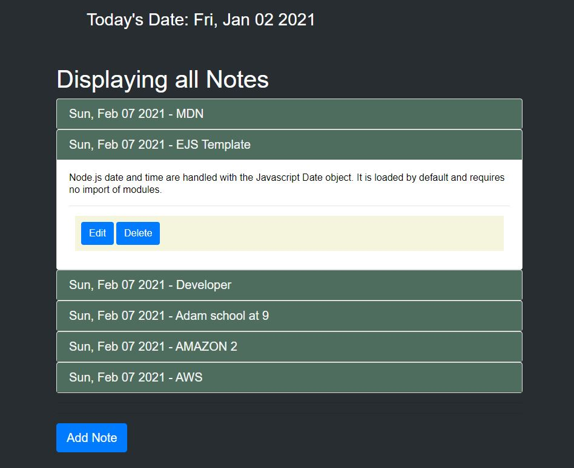

<!-- PROJECT LOGO -->
<br />
<p align="center">
  https://github.com/mygithub23/Note-Taker
  <br />
   

  <h3 align="center">Note Taker</h3>

  <p align="center">
    <a href="https://github.com/mygithub23/Note-Taker"><strong>Explore the docs »</strong></a>
    <br />
    <br />
    <a href="https://github.com/mygithub23/Note-Taker">View Demo</a>
    ·
    <a href="https://github.com/mygithub23/Note-Taker/issues">Report Bug</a>
    ·
    <a href="https://github.com/mygithub23/Note-Taker/issues">Request Feature</a>
  </p>
</p>


<!-- TABLE OF CONTENTS -->
<details open="open">
  <summary><h2 style="display: inline-block">Table of Contents</h2></summary>
  <ol>
    <li>
      <a href="#Screenshot">Screenshots</a>
      <ul>
        <li><a href="#Demo">Project Demo</a></li>
      </ul>
    </li>
    <li>
      <a href="#Short-Description">Project Objective</a>
      <ul>
        <li><a href="#Project-Description">Project Description</a></li>
      </ul>
    </li>
    <li>
      <a href="#getting-started">Getting Started</a>
      <ul>
        <li><a href="#prerequisites">Prerequisites</a></li>
        <li><a href="#Technologies">Technologies</a></li>
        <li><a href="#installation">Installation</a></li>
      </ul>
    </li>
    <li><a href="#usage">Usage</a></li>
    <li><a href="#How-to-test">How to Test</a></li>
    <li><a href="#license">License</a></li>
    <li><a href="#contact">Contact</a></li>
  </ol>
</details>

##Title

Note Taker

## Screenshots




### ✨Demo

Project Link: [https://github.com/https://github.com/mygithub23/Note-Taker/Note-Taker](https://github.com/mygithub23/Note-Taker)
https://github.com/mygithub23/Note-Taker<br>


<!-- ABOUT THE PROJECT -->

## Project Objective
  application that will help a small business to keep track of daily tasks and notes.

## Preject Description
The central feature that distinguishes the REST architectural style from other network-based styles is its emphasis on a uniform interface between components (Figure 5-6). By applying the software engineering principle of generality to the component interface, the overall system architecture is simplified and the visibility of interactions is improved. Implementations are decoupled from the services they provide, which encourages independent evolvability. The trade-off, though, is that a uniform interface degrades efficiency, since information is transferred in a standardized form rather than one which is specific to an application's needs. The REST interface is designed to be efficient for large-grain hypermedia data transfer, optimizing for the common case of the Web, but resulting in an interface that is not optimal for other forms of architectural interaction.


### Prerequisites
Need access to Internet to install all project dependencies.

## Technologies 
```
Nodejs, javascript, inquirer, chalk
```

## Installation
on project root directory type >> npm install

## Usage 
```
How to use the project - 
Click on any note to view note detail
Click on any note to view note detail
click on Edit to edit note
Click on Delete to delete note
```

## How to test
```
node index.js

// Click on any note to view note detail
app.get('/notes',(req,res) => {
    res.render('notes/index', { notesData })
})

click on Edit to edit note

//Edit/Update a note
app.patch('/notes/:id',(req, res)=>{
    const { id } = req.params;
    const foundNote = notesData.find(i => i.id === id)
    const newTtitle = req.body.title;
    const newText = req.body.text;
    foundNote.title = newTtitle;
    foundNote.text = newText;
    res.redirect('/notes')
})

//Edit form - need method-override 
app.get('/notes/:id/edit',(req,res) => {
    const { id } = req.params; 
    const note = notesData.find(i => i.id === id)
    res.render('notes/edit', { note })
})

Click on Delete to delete note
app.delete('/notes/:id',(req, res)=>{
    const { id } = req.params;
    notesData = notesData.filter(d => d.id !== id);
    //saveNotes(notesData)
    res.redirect('/notes')
})

```

<!-- LICENSE -->
## License
This project is [MIT](https://choosealicense.com/licenses/MIT/) licensed.<br />

  Copyright © 2021 [Ali Alaoui}](https://github.com/mygithub23})
  


<!-- CONTACT -->
## Contact
Contact the author with any questions!<br>
* Twitter:      [@myTwitterHandle](https://twitter.com/@myTwitterHandle)
* Github link:  @[mygithub23](https://github.com/mygithub23)<br>
* Email:        ali.alaoui@gmail.co
* heroku:       https://notes-taker-manager.herokuapp.com/ 
* heroku git:  https://git.heroku.com/notes-taker-manager.git
